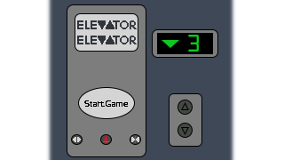
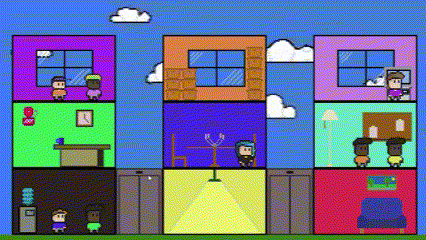

# 🛗🛗 Elevator Elevator

Control two elevators simultaneously and get people where they need to go! Feel the rise and fall with relaxing funk.

Elevator Elevator was made during [Gamedev.js Jam 2025](https://itch.io/jam/gamedevjs-2025).

## [Play on itch.io](https://sunnbursts.itch.io/elevator-elevator)

# ⌨️⌨️ How To Play:

Control the elevators with:
- W/S : move left elevator up/down
- A/D: pickup / offload passenger to the left / right of the left elevator
- ⬆️/⬇️ : move right elevator up/down
- ⬅️/➡️: pickup / offload passenger to the left/right of the right elevator

Hints:
- Each elevator can only hold one passenger at a time, so make your moves carefully!
- Their shirt colors match the walls of the room

P.S. Secret ~~tunnel~~ at the end!

# 💻💻 Repo setup
1. Download [Godot 4.4](https://godotengine.org/download/archive/4.4-stable/)
2. Clone repo
3. Open project.godot
4. Run game in godot editor, or make your own changes

# 🎨🎨 Acknowledgements
- Tada Sound Effect by [u_8g40a9z0la](https://pixabay.com/users/u_8g40a9z0la-45586904/?utm_source=link-attribution&utm_medium=referral&utm_campaign=music&utm_content=234709) from Pixabay
- All other art / sound assets were made by [meraclee](https://github.com/meraclee)